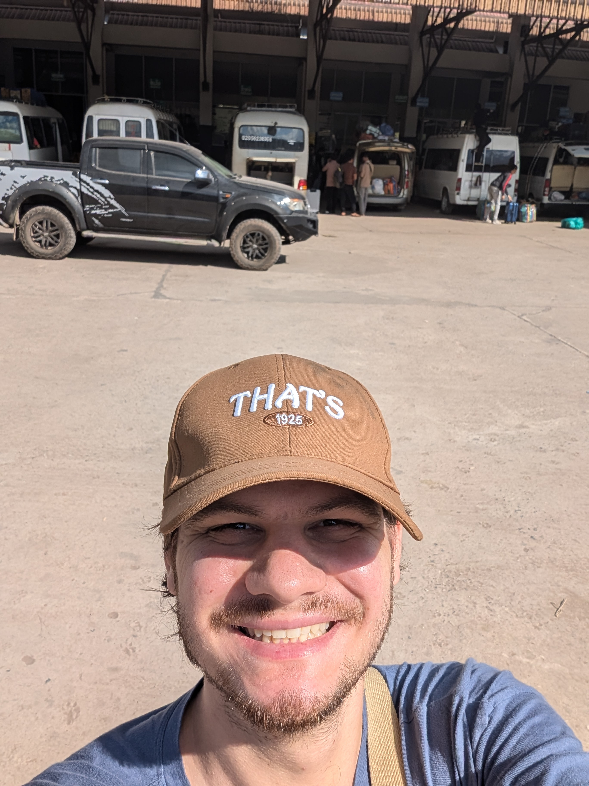

## Prelude

Departure day for Bountai. I’m in Bangkok, over 1,100 kilometers from my destination, and a long day awaits: a plane, a train, and a bus.

I wake up at 5:00 AM to start with a flight to Luang Prabang. A quick one-hour flight, nothing too stressful, but no time to waste upon arrival. I have two hours to get my visa, clear customs, and catch my train. Thankfully, everything goes smoothly. A line forms, and I get through fairly quickly. A taxi takes me to the train station.

The China-Laos railway is modern and efficient, but it’s pure chaos. The Chinese aren’t particularly orderly—it’s every person for themselves as they scramble to grab a seat first. Strangely enough, no one gets upset or raises their voice; they remain impressively calm despite the disarray. Once seated, it’s full steam ahead to Muang Xai, a one-hour journey that goes by quickly.

Upon arriving in Muang Xai, I head straight to the bus station. It’s 1:30 PM, and the van to Bountai is scheduled to leave at 2:00. Lucky timing! Or so I thought... In the end, we don’t leave until 4:00, and instead of fifteen passengers as expected, there are twenty-five crammed into the van. After waiting two hours in the heat, we set off for a four-hour winding journey through the mountains. My legs are wedged in, there’s no space, but hey, it’s an adventure.

Around 6:00 PM, we stop for dinner as night falls. Here in Laos, people live by the rhythm of the sun, from 5:00 AM to 5:30 PM. I arrive in Bountai around 8:00 PM, completely enveloped in darkness. It’s impossible to see anything. The van drops me off at the foot of my guesthouse. After picking up my keys, dropping off my stuff, and taking a shower, I head out to grab a bowl of soup from the small restaurant across the street. The waitress, already in bed in a corner of the restaurant, gets up to serve me.

Bountai is a significant village in this remote region of Laos. Yet, corrugated metal houses and dirt roads dominate the scenery. But it’s nighttime, so I can’t fully grasp the atmosphere yet. I head back to my guesthouse. The toilets? No flush, just a bucket and a bowl to pour water. Still, these will turn out to be the most comfortable toilets I’ll have for the next three days.

The next morning, after a good sleep-in, I decide to wander around the village. The locals stare at me curiously—they probably don’t see many tourists around here. I set off to book guesthouses for my group of friends arriving that evening. After making the reservations and paying, I spend the rest of the day taking it easy.

By evening, my friends finally arrive. We meet up at the village restaurant for a lively reunion over a few beers. Later, the group from the previous trek joins us. Only three treks are organized in Bountai this year, and two of them are back-to-back. A large table forms, and we end up having one of the best nights of my entire trip. We laugh, drink, share stories, and... eventually finish all the beer in the restaurant.

When it’s time to sleep, I know the night will be short. The beers have left me with quite a headache. But no matter, the night was worth every sip!

   

## The Team

Before setting off, let me introduce the team:

**Adone**, our local guide, is a journalist in the region. He is responsible for delivering news to Bountai and is paid by the Laotian government. He knows this area well, as it’s already his fifth time doing this trek. Adone is passionate about the jungle and nature. Even on his days off, he goes hunting, fishing, or wanders through the jungle. He will serve as our interpreter, and it’s impressive how polyglot he is: English, Lao, and even the local dialects of the villages we’ll visit.

[Adone](adone.jpg)

**Vincenzo**, an Italian, is a naval doctor in the Italian Navy. Probably the laziest soldier in the world, but also one of the kindest and most gentle people I’ve ever met. An example of calm and compassion. He’s also very funny and learns languages at an impressive speed. He wants to become a psychologist, and I’m sure he’ll be an excellent one. Vincenzo, Eline, and I have all been through challenging times this year. It’s comforting to see that everyone, whether a seasoned military officer or a lively young Belgian woman, has their own struggles.

[Vincenzo](vicenzo.jpg)

**Marguarita aka Poussinet & Pierre**, a newlywed Franco-Armenian couple on their honeymoon, are absolutely adorable. They sneak off to kiss, and it’s incredibly cute. Marguarita is super sweet with a strong personality. I ask her many questions about Armenia, and she paints a wonderful picture of her country. I’d love to visit next year. Pierre, on the other hand, has a calm demeanor but is equally kind and funny.

[Margarita & Pierre](mako_pierre.jpg)

**Eline** is the one who suggested I join this trek. She’s a lively young Belgian woman with boundless energy, the type to tackle 100-kilometer treks. I met her in Vientiane before my trip to Thailand, and we share plenty of laughs. She’s one of the great connections I’ve made on this journey. She inspires me to keep doing these kinds of activities and meeting new people.

[Eline](eline.jpg)

## First Day

### In the Jungle, the Mighty Jungle...

Here we go, it’s departure time. We all meet up to grab a few things, including fruits for the road and school supplies for the children in the second village we’ll visit. A bumpy but fun 4x4 ride takes us to the edge of the jungle. Once dropped off, we start walking and quickly stop by a coriander field to pick a few sprigs—enough to make anyone who knows me gag.

After about an hour of walking, we take a lunch break. It’s 11 a.m., and our guide prefers that we eat before tackling the upcoming jungle ascent, which promises to be challenging. We stop at a farmer’s shelter to prepare our meal. Between lighting the fire, searching for papaya, banana leaves, and jungle lettuce for the soup, and cleaning up afterward, everyone gets involved. It’s impressive to see how much of what we need can be found in nature. That said, we cheat a little for this first meal: our guide Oun’s mother prepared marinated pork with rice to complement the soup. It’s absolutely delicious—maybe too delicious, as I make the mistake of indulging a bit too much.

Things quickly get tough for me after that. We resume the hike, facing two hours of uphill jungle climbing followed by nearly three more hours to reach the first village. Challenges arise quickly. Vincenzo, our trekking buddy, has lower back pain but doesn’t complain—ever the stoic soldier. As for me, I start to struggle. With a full stomach, digestion is tough, and mild nausea sets in. Thankfully, it passes after about half an hour, but the exhaustion catches up with me on this seemingly endless climb. There’s no clear trail here: Adone, one of our guides, is marking the path for future expeditions. The jungle reclaims its space quickly, and we are only the third or fourth group to pass through.

Finally, at the forest’s edge, we reach rice fields that were harvested a few weeks earlier. The effort required from the farmers is astounding, especially considering how far they are from their village. Some even have to stay on-site for days at a time. We encounter workers taking a break, who offer us a snack: plants mixed with chili. It’s energizing but very spicy! A woman nearby captures a bird, snaps its neck, and cooks it—a rather unusual snack. We continue through the fields, admiring Laos’s breathtaking landscapes.

As night falls, we finally arrive at the first village, a stilted hamlet with mostly wooden houses. We head to the chief’s house, where we’ll spend the night.

### The First Night

The village is called Nam Khoun, and the chief’s name is Boun Mai, along with his wife Lin. They welcome us with a cup of tea. After brief exchanges of smiles, we head to take a shower. Naively, I had been looking forward to the hot shower Adone had promised during the climb. Eager to freshen up, I quickly realize I’ve been too gullible. Upon reaching the river, I’m greeted by ice-cold water. A classic tourist mistake.

After the shower, we start preparing dinner. The village cannot offer us a chicken tonight, so they decide to cook a duck instead. No complaints from me! The meal consists of green pumpkin, which tastes similar to potatoes, sticky rice, salad, and, of course, the duck. The sticky rice is eaten with your hands, rolled into small balls that you dip into the sauce. The duck’s liver is lightly cooked and served as an appetizer—it’s incredibly tender. Even the blood is utilized: collected in a bowl, it’s mixed with the coriander we picked in the morning and finely chopped banana leaves. Left to sit, the blood coagulates into a gelatinous dish, served with a shot of rice whiskey—an essential to "kill the bacteria."

Dinner is a memorable experience. Around the fire, I get to know my companions better and learn about local life. There’s little to no electricity—just a single lamp. We discover that the village chief is elected for five years. He holds the role because he is the only one educated. He speaks calmly and is barely older than me. Life here is tough, and the villagers don’t seem particularly happy. We discuss ceremonies, the shaman’s role, and local customs. The night has been pitch-black for hours, and we can barely make each other out in the chief’s house.

It’s time to sleep—it must be around 10 p.m. However, the chief invites Vincenzo and me to join him in the elders’ hut to smoke opium. I politely decline but decide to accompany them out of curiosity. To be honest, we’ve already had quite a bit of rice whiskey, as it’s customary to toast after every sip during meals. In the hut, the night continues. The opium, apparently, isn’t very strong, but it’s smoked continuously, without pause.

Finally, it’s time to call it a night. We sleep in the main room with the chief and his family—about a dozen of us in total. Tomorrow will be a big day: we’re going FISHING!

## Second Day

### Sunrise

I didn’t get much sleep that night, though not necessarily because of discomfort. I wake up around 5 a.m. to enjoy the sunrise and watch the village slowly come to life. The first light appears at 5:30, as the women begin preparing rice for breakfast.

I notice there are many dogs in the village. Their role is rather peculiar: they eat the inhabitants' waste. Yes, you read that right—there are no toilets here. Yum... appetizing. Slowly, the village starts to wake up. Margarita and Pierre join me shortly after, and together we explore the village under the soft morning light. We encounter pigs and villagers already hard at work, crafting planks likely intended for building or repairing houses.

Heading back to the river, we discover the village’s primary source of electricity: small dams. The river’s width is narrowed to increase the flow, powering a propeller connected to a turbine that generates electricity. We also hear music playing from the village, likely powered by a few solar panels scattered here and there.

Breakfast is hearty, consisting of leftovers from the previous night’s meal. Since the first dinner, I’ve been careful to eat more moderately. In fact, one of my goals for this trip is to overcome my addictions, whether to food or the Internet. This morning, they’ve killed a chicken especially for us. It will be prepared for lunch to accompany the fruits of our fishing trip.

### Fishing

We head upstream to the river to fish and prepare our lunch. After about 45 minutes of walking, we find a spot where the river splits into two streams that reconnect further down. This is key: we’ll dry up one of the branches to catch fish by hand.

The work begins, and it’s quite tough. First, we build a dam with rocks, sealing it with mud. I must admit, this step is pretty fun—a real return to childhood, but on a larger scale. Next, we have to drain the water from the sections using buckets. That’s a whole different challenge: it’s exhausting. The chief, Adone, and Lin, the chief’s wife, work tirelessly. Lin, in particular, earns my respect for her endurance and determination.

Once the section is dry, we dig through the mud to find fish. They’re tiny, but there are many of them. We also find frogs. The chief, without hesitation, breaks the frogs’ legs to prevent them from escaping. It’s brutal, but here, it’s eat or go hungry.

We repeat the process until we reach the confluence of the streams, about 80 meters away. It’s long and exhausting, taking us nearly two hours in total. By the end, our bamboo containers are filled with fish, two limping frogs, and even a few insects.

Then comes lunch preparation. A fire is lit, and Adone cuts pieces of bamboo to use as utensils: cups, skewers, and even plates. The meal is hearty, naturally accompanied by rice wine.

I understand why they rarely fall ill: between their constant physical activity and simple but balanced meals, their lifestyle seems well-suited to maintaining health. The life expectancy here is around 75 years, which is relatively high. However, I imagine infant mortality rates are still significant, and dental issues must be common in these remote villages.

### On My Way

After lunch, we bid farewell to the chief and his family, then set off toward the next village. The path, though winding and hilly, is breathtakingly beautiful and pleasant. I truly enjoyed this walk.

During the journey, I chatted a lot, especially with Eline. We found a good rhythm, and without realizing it, ended up outpacing the rest of the group. This led us to a crossroads where we had to wait for several minutes. While waiting, we encountered two women, each carrying at least 40 kilos on their backs. Despite their heavy loads, they stopped and, in a spontaneous act of generosity, offered us a papaya and a sugarcane.

That brief moment was filled with an indescribable magic. Eline and I stood there, speechless, deeply touched by their kindness. While waiting for the rest of the group, we savored these simple yet precious gifts, sharing a unique moment of connection.

Once the group caught up, we continued on our way. After about ten minutes, we came across a small water retention basin with a jet of water flowing right in the middle of the path. Adone quickly explained that this jet was our last chance to wash ourselves for the remainder of the trek.

Initially hesitant, we eventually took turns under the jet. It turned into a funny and lighthearted moment, especially seeing the intrigued – sometimes amused – looks of passersby, particularly the women. These simple and laughter-filled moments will remain some of the most cherished memories of this adventure.

Alright, let’s go! The village is now just a short half-hour walk away.

### The Village

We arrive at the village of Pouli Mai, greeted by dozens of curious and smiling children. Unlike the first village, Pouli Mai is much larger, with a population of 630 inhabitants, though it lacks running water. As we make our way through the village, we reach the home of the chief, Atchou, who warmly welcomes us with a glass of boiled water.

After handing out some candies to the children, it’s already time for dinner. On the menu: a delicious omelet paired with sticky rice, of course, and a banana leaf salad. Simple, yet delightful.

By 7 p.m., night has fallen, plunging the village into total darkness. A single small lamp illuminates the entire house, which is rudimentary but surprisingly cozy. Tonight, as before, we’ll all sleep together on a shared large bed.

Before bed, we spend some time talking with the chief. He offers the women in our group the opportunity to try on the traditional outfits worn during wedding ceremonies, complete with a headpiece adorned with old coins. Upon closer inspection, we discover that these are coins from the Indochina era – an unexpected and fascinating find.

It’s time to sleep. It must be around 9 p.m., an early hour for me, but here, village life follows the rhythm of the sun. The night, though short, is pleasant and peaceful.

## Third Day

We rise at dawn with the rest of the group. We all slept reasonably well, but Enzo is not in great shape with his toe, although he feels fit to walk. He never says no, a true soldier. A hearty breakfast awaits us: chicken and rice, an unbeatable classic.

To wake up a bit, we take a short tour of the village, where humans and animals blend seamlessly. We cross paths with women returning from the jungle carrying wood for the fire. It's one of my favorite photos. The children follow us nonstop, and to shoo them away, we talk to them or take their picture. They repeat everything we say without truly understanding.

After completing the village tour, we return to finish our business and leave the village, offering school supplies to the chief.

We set off again, with a good day of hiking through the magnificent landscapes of Laos ahead of us—about 4 hours of walking. After two hours, we arrive at a village similar to the second, fairly large. It's around noon, and we decide to stop for a snack, but not for lunch. Our first dose of sugar on this trek: puffed rice. This village seems a bit more connected to the outside world, with running water and beers. After a short hour, we continue.

We carry on through the mountains. Everyone remains cheerful and content, I think. After another two hours, we finally reach the rendezvous point with the vehicle that will take us back. Honestly, I would have liked to keep walking to enjoy the view, but the pain in my feet is becoming noticeable, and the injuries within the team don't help. So, we're all quite happy to head back.

### At Adone's and the Departure

It takes us a good 45 minutes to return to Boun Tai. Once we arrive at our destination, we're dropped off at our guesthouses. A nice shower (if the water decides to cooperate!) and then it's off to Adone's for dinner. We can’t wait... but no more water, so no shower.

At Adone's, he welcomes us like royalty and offers to do our laundry. What a treat! We dine like kings, with rice, bean salad, probably the best I’ve ever had. A true delight. Adone tells us we're lucky, as a shaman is in a nearby house performing a ritual. The girls decide to go and take some videos. On this wonderful note, we head back; a long journey awaits us tomorrow.

After a good night’s sleep and breakfast at a restaurant, it's time to say our goodbyes to Adone and board the bus. A 4-hour ride ahead. Honestly, given the speed of the driver, the trip could’ve been shorter... and our lives too! A truck accident on a dirt road halts us for nearly an hour.

We finally arrive in Muang Xai, just in time for lunch, then head to the station for Luang Prabang. It's time to say goodbye to Vincenzo. Eline, Pierre, Margarita, and I will stay a few more days in Luang Prabang.

And so ends one of the most beautiful adventures of my life, filled with discoveries, hiking, and encounters.