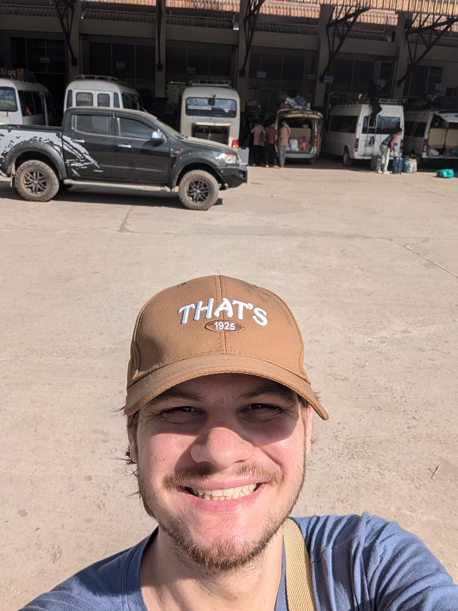

# Prelude

Jour de départ pour Bountai. Je suis à Bangkok, à plus de 1100 kilomètres de ma destination, et une longue journée m'attend : un avion, un train, et un bus.

Réveil à 5h00 du matin pour commencer avec l’avion direction Luang Prabang. Une petite heure de vol, rien de stressant, mais pas question de traîner à l’arrivée. J’ai deux heures pour obtenir mon visa, passer la douane et attraper mon train. Finalement, tout se passe bien. Une file s’organise, et je finis par passer assez rapidement. Un taxi m’emmène à la gare.

La ligne de train Chine-Laos est moderne et efficace, mais c’est un vrai chaos. Les Chinois ne sont pas très ordonnés : c’est chacun pour soi, tout le monde se bouscule pour s’asseoir en premier. Étrangement, personne ne s’énerve ni ne crie ; ils restent d’un calme impressionnant, malgré le désordre ambiant. Une fois installé, cap sur Muang Xai. Une heure de trajet, qui passe assez vite.

Arrivé à Muang Xai, je me rends directement à la station de bus. Il est 13h30, et le van pour Bountai part à 14h. Coup de chance ! Enfin, c’est ce que je pensais... Nous ne partons finalement qu’à 16h, et pas à quinze dans le van comme prévu, mais à vingt-cinq. Deux heures à attendre dans la chaleur pour ensuite entamer quatre heures de route sinueuse à travers les montagnes. Mes jambes sont coincées, il n’y a aucune place, mais c’est folklorique.

Une pause dîner à mi-chemin, vers 18h, alors que la nuit tombe. Ici, les Laotiens vivent au rythme du soleil, de 5h à 17h30. J’arrive à Bountai vers 20h, plongé dans une nuit noire. Impossible de voir quoi que ce soit. Le van me dépose au pied de ma guesthouse. Le temps de récupérer les clés, poser mes affaires et prendre une douche, je redescends pour demander un bol de soupe dans le petit restaurant en face. La serveuse était déjà dans son lit, dans un coin du restaurant...

Bountai est un village important dans cette région reculée du Laos. Pourtant, les maisons en tôle et les routes en terre battue dominent le décor. Mais il fait nuit, alors je ne me rends pas encore bien compte de l’ambiance. Je retourne à ma guesthouse. Les toilettes ? Pas de chasse d’eau, juste un seau et un bol pour verser de l’eau. Et encore, ce seront les toilettes les plus confortables des trois prochains jours.

Le lendemain, après une bonne grasse matinée, je décide de me balader dans le village. Les habitants me dévisagent, intrigués : ils ne doivent pas croiser souvent de touristes. Je pars réserver des guesthouses pour mon groupe d’amis, qui arrivent le soir. Une fois les réservations faites, je paie et termine ma journée calmement.

Le soir venu, mes amis arrivent enfin. Nous nous retrouvons au restaurant du village pour des retrouvailles animées autour de quelques bières. Plus tard, le groupe du trek précédent nous rejoint. Trois treks sont organisés à Bountai cette année, et deux se suivent de près. Une grande tablée se forme, et nous passons une des meilleures soirées de tout mon voyage. On rit, on boit, on partage des histoires, et... on finit par vider toutes les bières du restaurant.

Quand il est temps d’aller dormir, je sais que la nuit sera courte. Les bières m’ont laissé un sacré mal de crâne. Mais qu’importe, cette soirée en valait chaque goutte !

   

# La Team

Avant de partir, je vous présente la Team :

**Adone**, notre guide local, est journaliste dans la région. Il est chargé de transmettre les nouvelles à Bountai et est rémunéré par le gouvernement laotien. Il connaît bien cette région, c’est déjà la cinquième fois qu’il fait ce trek. Adone est un passionné de jungle et de nature. Même lors de ses jours de repos, il s’adonne à la chasse, à la pêche ou se promène dans la jungle. Il nous servira d’interprète, et c’est impressionnant de voir à quel point il est polyglotte : anglais, lao, et même les dialectes locaux des villages que nous allons traverser.

**Vincenzo**, un Italien, est médecin officier dans la marine italienne. Probablement le militaire le plus fainéant du monde, mais aussi l’une des personnes les plus douces et gentilles que j’ai jamais rencontrées. Un exemple de calme et de bienveillance. Il est également très drôle et apprend les langues avec une rapidité qui m’étonne. Il veut devenir psychologue, et je suis sûr qu’il en sera un excellent. Vincenzo, Eline et moi avons traversé des périodes compliquées cette année. C’est rassurant de voir que tout le monde, que ce soit un militaire chevronné ou une jeune femme belge pleine d’énergie, a ses propres démons.

**Marguarita alias Mako alias Poussinet & Pierre**, un couple franco-arménien fraîchement marié et en lune de miel, sont adorables. Ils se cachent pour s’embrasser, et c’est trop mignon. Marguarita est super gentille, avec un caractère bien trempé. Je lui pose beaucoup de questions sur l’Arménie, et elle donne une superbe image de son pays. J’aimerais beaucoup y aller l’année prochaine. Pierre, quant à lui, a un tempérament posé, mais il est tout aussi gentil et drôle.

**Eline** est la personne qui m’a proposé de faire ce trek. C’est une jeune femme belge pleine d’énergie, du genre à faire des treks de 100 kilomètres. Je l’ai rencontrée à Vientiane avant mon départ pour la Thaïlande, et on rigole bien ensemble. Elle fait partie des belles rencontres de ce voyage. Elle m’inspire à continuer ce genre d’activités et à aller à la rencontre des gens.

# Premier Jour

## Dans la jungle, terrible jungle...

Ça y est, c'est le départ. On se retrouve tous pour faire quelques achats, dont des fruits pour la route et des fournitures scolaires pour les enfants du second village que nous visiterons. On nous emmène à l'orée de la jungle en 4x4, une expérience secouante mais néanmoins très marrante. Une fois déposés, nous commençons la marche et nous arrêtons rapidement devant un champ de coriandre où nous récoltons quelques brins, à en vomir pour ceux qui me connaissent.

Après une petite heure de marche, nous faisons une pause déjeuner. Il est 11 h, et notre guide préfère que nous ayons le ventre plein avant d'attaquer l'ascension de la jungle, qui s'annonce ardue. Nous nous arrêtons dans un abri de paysan pour préparer le repas. Entre le feu, la recherche de papaye, de feuilles de bananier et de laitue dans la jungle pour la soupe, et la vaisselle, tout le monde s'active. C'est impressionnant de voir à quel point tout ce dont on a besoin peut être trouvé dans la nature. Cela dit, pour ce premier repas, on triche un peu : la mère de notre guide, Oun, nous a préparé du porc mariné avec du riz, en complément de la soupe. Un vrai régal. Peut-être un peu trop, car je commets l'erreur de me laisser aller à la gourmandise.

La suite va vite devenir compliquée pour moi. Nous reprenons la marche avec deux heures de montée à travers la jungle devant nous, suivies de près de trois heures pour atteindre le premier village. Assez rapidement, les difficultés commencent. Vincenzo, notre compagnon de trek, a des douleurs au bas du dos, mais en bon militaire, il ne se plaint pas. De mon côté, je commence à faiblir. L'estomac plein, la digestion est difficile, et une légère nausée s’installe. Heureusement, cela passe au bout d’une demi-heure, mais l’épuisement me rattrape sur cette montée interminable. Pas de sentier clair ici : Adone, l’un des guides, marque le chemin pour les prochaines expéditions. La jungle reprend vite ses droits, et nous ne sommes que le 3ᵉ ou 4ᵉ groupe à passer par là.

Enfin, à la lisière de la forêt, nous atteignons des champs de riz récoltés quelques semaines plus tôt. Le travail accompli par les paysans est impressionnant, surtout si loin de leur village. Certains doivent même rester plusieurs jours sur place. Nous croisons des ouvriers en pause qui nous offrent un goûter : des plantes mélangées à du piment. C’est revigorant, mais très épicé ! Une femme à côté de nous vient de capturer un oiseau ; elle lui tord le cou pour le cuire et le manger — un encas un peu particulier. Nous continuons à travers les champs, en admirant les paysages spectaculaires du Laos.

À la tombée de la nuit, nous arrivons enfin au premier village, un hameau sur pilotis avec des maisons principalement en bois. Nous nous dirigeons vers la maison du chef, où nous passerons la nuit.

## La première nuit

Le village porte le nom de Nam Khoun et le chef s'appelle Boun Mai avec sa femme Lin. Ils nous offrent un thé de bienvenue. Après de brefs échanges de sourires, nous partons à la douche. Naïf que je suis, Adone m'avait fait miroiter pendant la montée une douche bien chaude. Je suis pressé de me décrasser, mais en arrivant à la rivière, je déchante vite : l'eau est glaciale. Je me rends compte que je suis vraiment trop naïf, typiquement un touriste.

En rentrant de la douche, nous nous mettons à préparer le dîner. Ils n'ont pas la possibilité de nous offrir un poulet ce soir, alors ils décident de cuisiner un canard à la place. Je ne dis pas non ! Le repas se compose de citrouille verte, dont le goût rappelle celui d'une pomme de terre, de riz collant, de salade et, bien sûr, du canard. Le riz, collant, se mange avec les mains en formant des boulettes qu’on trempe dans la sauce. Le foie du canard est extrait et légèrement cuit pour servir d'apéritif : c'est très doux. Même le sang est utilisé : récolté dans un bol, il est mélangé avec la coriandre cueillie le matin et des feuilles de bananier finement coupées. On laisse reposer jusqu'à ce que le sang coagule et forme une gélatine à manger, accompagnée d’un verre d’eau-de-vie de riz, un incontournable pour "tuer les bactéries".

Le dîner est une belle expérience. J'apprends à mieux connaître mes camarades et la vie locale autour du feu. Il n'y a pas d’électricité, ou très peu : juste une lampe. Nous apprenons que le chef est élu pour cinq ans. ... est le chef parce qu'il est le seul instruit. Il parle calmement, à peine plus âgé que moi. La vie ici est dure, et ils ne semblent pas particulièrement heureux. Nous discutons des cérémonies, du rôle du chaman, et des coutumes locales. La nuit noire s’installe depuis quelques heures, et on commence à peine à se distinguer dans la maison du chef.

Il est temps de dormir, il doit être 22 h. Cependant, le chef m'invite avec Vincenzo à fumer de l'opium dans la cabane des anciens. Je refuse poliment mais décide de les accompagner par curiosité. À vrai dire, nous avons déjà bu beaucoup d’eau-de-vie, car il est de coutume de trinquer entre chaque gorgée au repas. Dans la cabane, la soirée continue. L’opium, apparemment, n’est pas si fort, mais il se fume longtemps, sans arrêt.

Enfin, il est temps d’aller au lit. Nous dormons dans la pièce principale avec le chef et sa famille : nous sommes bien une douzaine. Demain est une grosse journée : nous partons à la PÊCHE !

# Deuxième Jour

## Le levé

Je ne vais pas beaucoup dormir cette nuit-là, mais pas forcément à cause de l’inconfort. Je me lève vers 5 h du matin pour profiter du lever du soleil et observer le village s’éveiller doucement. Les premières lueurs apparaissent à 5 h 30, alors que les femmes commencent à préparer le riz pour le petit-déjeuner.

Je remarque qu’il y a beaucoup de chiens dans le village. À vrai dire, ils jouent un rôle un peu particulier : ils mangent les déjections des habitants. Eh oui, ici, pas de toilettes. Miam… appétissant. Petit à petit, le village s’anime. Margarita et Pierre me rejoignent rapidement, et nous partons ensemble découvrir le village à la lumière naissante. Nous croisons des cochons et des habitants déjà au travail, fabriquant des planches, probablement pour construire ou réparer une maison.

En retournant à la rivière, nous découvrons la principale source d’électricité du village : de petits barrages. La largeur de la rivière est réduite pour augmenter le débit, ce qui alimente une hélice reliée à une turbine qui génère de l’électricité. Nous entendons aussi de la musique venant du village, probablement alimentée par quelques panneaux solaires visibles ici et là.

Le petit-déjeuner est copieux : des restes du repas de la veille. Depuis le premier repas, je fais attention à manger de manière raisonnable. À vrai dire, c’est l’un des objectifs de ce voyage : me débarrasser de mes addictions, que ce soit à la nourriture ou à Internet. Ce matin, ils ont tué une poule spécialement pour nous : elle sera préparée pour le déjeuner, accompagnant les fruits de notre pêche.

## La pèche

Direction la rivière en amont pour pêcher et préparer notre déjeuner. Après environ 45 minutes de marche, nous trouvons un endroit où la rivière se divise en deux cours d’eau qui se rejoignent plus loin. C’est un élément clé : nous allons assécher l’un des bras pour attraper les poissons à mains nues.

Le travail commence, et il est assez ardu. Nous formons d’abord un barrage de pierres, que nous colmatons avec de la boue. Je dois avouer que cette étape est plutôt amusante : un vrai retour en enfance, mais grandeur nature. Ensuite, il faut vider l’eau des sections avec des seaux. Là, c’est une autre paire de manches : c’est épuisant. Le chef, Adone, et Lin, la femme du chef, travaillent comme des acharnés. Lin force vraiment mon respect par son endurance et sa détermination.

Une fois la section asséchée, nous fouillons la boue à la recherche de poissons. Ce sont de tout petits poissons, mais ils sont nombreux. On trouve aussi des grenouilles. Le chef, sans hésitation, brise les pattes des grenouilles pour éviter qu’elles ne s’échappent. C’est brutal, mais ici, c’est manger ou ne pas manger.

Nous reproduisons le procédé jusqu’à atteindre le croisement des cours d’eau, environ 80 mètres plus loin. C’est long et éprouvant : l’ensemble nous prend près de deux heures. Nos bambous sont finalement remplis de poissons, de grenouilles boiteuses (deux exactement) et même d’insectes divers.

Vient alors la préparation du déjeuner. Un feu est allumé, et Adone coupe des morceaux de bambou qui serviront de vaisselle : verres, brochettes, et même assiettes. Le repas est copieux, accompagné – bien sûr – d’eau de vie.

Je comprends pourquoi ils tombent rarement malades : entre l’effort physique constant et leurs repas simples mais équilibrés, leur mode de vie semble bien réglé. L’espérance de vie ici est de 75 ans, ce qui est plutôt élevé. Mais je suppose que la mortalité infantile reste importante, et les problèmes dentaires doivent être fréquents dans ces villages reculés.

## sur ma route, oui...

Une fois le déjeuner terminé, nous faisons nos adieux au chef et à sa famille, puis nous reprenons la route vers le prochain village. Le sentier, bien que sinueux et vallonné, est incroyablement beau et agréable. J’ai vraiment adoré cette marche.

Pendant le trajet, j’ai beaucoup discuté, notamment avec Eline. Nous avons pris un bon rythme et, sans nous en rendre compte, avons fini par distancer le reste du groupe. Cela nous a menés à un croisement où nous avons dû attendre plusieurs minutes. C’est là que nous avons croisé deux femmes portant chacune au moins 40 kilos sur le dos. Malgré leur charge, elles se sont arrêtées et, dans un geste de générosité spontanée, nous ont offert une papaye et une canne à sucre.

Ce moment, bien que bref, était empreint d’une magie difficile à décrire. Eline et moi sommes restés bouche bée, touchés par leur gentillesse. En attendant le reste du groupe, nous avons dégusté ces cadeaux simples mais précieux, partageant un moment de complicité unique.

Une fois la troupe réunie, nous reprenons la route. Après une dizaine de minutes, nous tombons sur un petit bassin de rétention d’eau avec un jet d’eau en plein milieu du chemin. Adone nous explique rapidement que ce jet est notre dernière opportunité de nous laver pour le reste du trek.

Un peu hésitants au début, nous finissons par y aller un par un. Ce fut un moment drôle et léger, surtout en voyant les regards intrigués – parfois amusés – des passants, en particulier des femmes. Ces instants de simplicité et de rire resteront parmi les plus mémorables de cette aventure.

Allez, c’est reparti ! Direction le village, qui n’est plus qu’à une petite demi-heure de marche.

## Le village

Nous arrivons au village de Pouli Mai, accueillis par des dizaines d’enfants curieux et souriants. Contrairement au premier village, Pouli Mai est bien plus grand, avec une population de 630 habitants, bien qu’il n’y ait pas d’eau courante. En traversant le village, nous arrivons à la maison du chef, Atchou, qui nous reçoit chaleureusement avec un verre d’eau bouillie.

Après avoir distribué quelques bonbons aux enfants, il est déjà l’heure de dîner. Au menu : une délicieuse omelette accompagnée de sticky rice, bien sûr, et une salade de feuilles de bananier. Simple, mais délicieux.

À 19 heures, la nuit est déjà tombée, plongeant le village dans une obscurité totale. Une seule petite lampe éclaire toute la maison, rudimentaire mais étonnamment confortable. Ce soir, comme la veille, nous dormirons tous ensemble sur un grand lit partagé.

Avant de nous coucher, nous passons un moment à échanger avec le chef. Il propose aux femmes de notre groupe d’essayer les tenues traditionnelles portées lors des cérémonies de mariage, ornées d’un bonnet décoré de pièces anciennes. En observant de plus près, nous réalisons qu’il s’agit de pièces datant de l’époque de l’Indochine – une découverte inattendue et fascinante.

Il est temps d’aller dormir. Il doit être environ 21 heures, un horaire tôt pour moi, mais ici, le rythme du village est calqué sur celui du soleil. La nuit, bien que courte, est agréable et paisible.

# Troisième Jour

Lever aux aurores avec le reste du groupe. Nous avons tous plutôt bien dormi, mais Enzo n’est pas dans un état incroyable avec son orteil, même s’il se sent apte à marcher. Il ne dit jamais non, un vrai militaire. Un petit déjeuner copieux nous attend : poulet et riz, un classique indémodable.

Pour nous réveiller un peu, on fait un petit tour du village. Un endroit où habitants et animaux se mélangent sans souci. Nous croisons des femmes revenant de la jungle avec du bois pour le feu. C'est l'une de mes photos préférées. Les enfants nous suivent sans arrêt, et pour les faire fuir, on leur parle ou on prend des photos. Ils répètent tout ce qu'on dit sans vraiment comprendre.

Une fois le tour du village terminé, nous rentrons finir nos affaires et quittons le village en offrant des fournitures scolaires au chef.

Nous reprenons la route, une bonne journée de marche à travers les magnifiques paysages du Laos nous attend. Environ 4 heures de marche. Après deux heures, nous arrivons dans un village similaire au second, plutôt grand. Il est 12h environ, et nous décidons de nous arrêter pour grignoter, mais pas pour déjeuner. Nous avons notre première dose de sucre de ce trek : du riz soufflé. Ce village semble un peu plus connecté au monde extérieur, avec de l'eau courante et des bières. Après une petite heure, nous repartons.

On continue notre chemin à travers les montagnes. Tout le monde reste souriant et content, je trouve. Après encore deux heures, nous arrivons enfin au point de rendez-vous avec le véhicule qui nous ramène. À vrai dire, j’aurais bien continué à marcher pour profiter de la vue, mais les douleurs aux pieds commencent à se faire sentir, et les blessures dans l’équipe n’aident pas. Du coup, nous sommes plutôt contents de rentrer. 

## Chez Adone et le départ

Il nous faut bien 45 minutes pour retourner à Boun Tai. Une fois arrivés à notre destination, chacun est déposé à sa guesthouse. Une bonne douche (si l’eau veut bien suivre !) et direction chez Adone pour le dîner. Nous avons hâte… mais plus d'eau, donc pas de douche.

Chez Adone, il nous reçoit comme des rois et nous propose de faire nos machines. Quel plaisir ! Nous dînons comme des rois, avec du riz, des haricots en salade, probablement les meilleurs que j’aie mangés de ma vie. Un véritable régal. Adone nous annonce que nous avons beaucoup de chance, une chamane se trouve dans une maison voisine pour faire un rituel. Les filles décident d'y aller et prennent quelques vidéos. Sur cette merveilleuse note, nous rentrons, un long trajet nous attend demain.

Après une bonne nuit de sommeil et un petit déjeuner dans un restaurant, il est temps de dire nos adieux à Adone et de monter dans le bus. Un trajet de 4 heures nous attend. À vrai dire, vu la vitesse du chauffeur, le trajet aurait pu durer moins longtemps… et nos vies aussi ! Un accident de camion sur une route de terre nous arrête pendant près d’une heure.

On arrive tant bien que mal à Muang Xai, le temps d’un déjeuner, puis direction la gare pour Luang Prabang. Il est temps de faire nos adieux à Vincenzo. Eline, Pierre, Margarita et moi resterons quelques jours à Luang Prabang.

C’est ainsi que se conclut l'une des plus belles aventures de ma vie, pleine de découvertes, de marche et de rencontres.