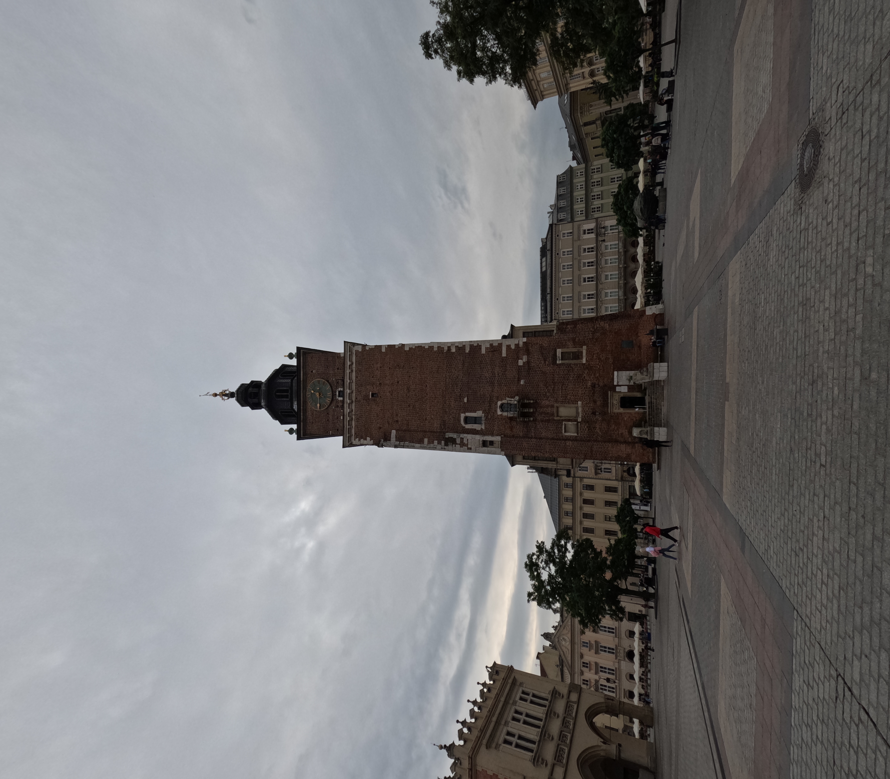

La Pologne, au cœur de l'Europe, est un pays riche en histoire, culture et traditions. Marquée par des siècles de bouleversements politiques et militaires, elle a su préserver son identité unique. Ma première destination est Cracovie, une ville médiévale qui fut autrefois la résidence des rois et reines de Pologne.

J'ai vraiment adoré Cracovie. C'est une ville splendide, et bien que j'avais le pressentiment que j'aimerais ce pays, il a largement dépassé mes attentes. Pour moi, c'est l'un des pays d'Europe à ne surtout pas manquer. Cracovie fait partie des plus belles villes que j'ai eu la chance de visiter.

## 16 Septembre

Je suis arrivé à 9h à l'aéroport de Cracovie. J'ai pris le bus direction le centre ville. Cracovie est une super jolie ville, le réseau de transport est extrèmement bien développé. Il y a beaucoup de tram et de bus. La première chose qui m'a choqué ce sont les passages piétons, 100% des voitures s'arrêtent au passage piéton. Bref. Le centre ville regorge de monuments historique, le centre est lui même classé au patrimoine mondial de l'UNESCO. J'ai fait la visite de Rynek Główny, une grande place avec une galerie marchande super mignonne.

J'ai déjeuner dans un petit restaurant assez mignon, j'ai pu gouter les spécialités Polonaises dont les fameux Pierogi, des ravioles avec de la viande haché, I-N-C-R-O-Y-A-B-L-E.

J'ai ensuite pu rejoindre mon appartement pour un repos bien mérité, puis je suis ressorti dans la soiré. De nuit la ville est d'autant plus jolie, j'avoue que j'étais bien crevé avec pas loin de 15 km de marche dans les pattes. Mais ça valait le coup.

   

   

## 17 Septembre

J’ai décidé de visiter l’emblématique quartier juif de Cracovie : Kazimierz. En chemin, je me suis souvent arrêté pour prendre des photos et profiter de l'atmosphère de la ville. Cracovie est vraiment une belle ville, où il fait bon se promener. Kazimierz est un quartier magnifique, avec de nombreux restaurants juifs traditionnels. Sa propreté et son charme nous feraient presque oublier qu'il a été presque entièrement détruit pendant la Seconde Guerre mondiale, et que nous nous trouvons à l'entrée de l'un des plus grands ghettos de cette époque. On peut encore voir, à certains endroits, des fragments du mur du ghetto.

Dans un premier temps, j’ai visité la plus vieille synagogue d’Europe. Je n’étais jamais entré dans une synagogue auparavant, donc j'en suis plutôt content. Ensuite, je suis allé visiter la célèbre usine de Schindler, où plusieurs centaines de Juifs ont travaillé pour échapper aux chambres à gaz. L’usine a été transformée en musée retraçant l’histoire de Cracovie pendant la Seconde Guerre mondiale. C’est assez terrifiant de constater à quel point le peuple polonais, en particulier les Juifs, a souffert durant cette période. La Pologne a perdu un habitant sur six pendant la guerre.

    

## 18 Septembre

Aujourd'hui, petite journée tranquille. Je suis allé visiter le château de Wawel, siège de la monarchie polonaise du XIème au XVIIème siècle. C'est un superbe édifice, mélangeant des styles gothique, renaissance et baroque. Le château abrite la cathédrale où ont été couronnés de nombreux rois polonais, ainsi que plusieurs trésors nationaux. Il surplombe Cracovie et la vue est magnifique !
Je ne suis pas rentré très tard, une migraine commence à pointer le bout de son nez. Et puis, j'ai pas mal vadrouillé ces derniers jours, alors petit beignet pomme-caramel, et je rentre me reposer.

    

# 19 Septembre

Journée éprouvante émotionnellement. Aujourd'hui, j'ai visité les camps d'Auschwitz-Birkenau. Sur les trois camps qui existaient, deux sont accessibles pour les visites. C'est assez compliqué de décrire les émotions que l'on ressent en découvrant ces lieux.

D'abord, la tristesse, à cause de ce qui s'est passé ici, de la folie humaine à l'œuvre dans ces camps. Cette tristesse laisse place à la peine lorsque vous traversez le tunnel menant aux camps et que vous entendez les noms des victimes. Plus d'un million de noms sont énoncés. En tant qu'ingénieur, j'ai calculé : il faudrait un peu moins de 8 ans pour prononcer le nom de toutes les personnes massacrées ici.

Ensuite, pendant la visite, vient la honte. La honte, parce qu'il est particulièrement difficile, au début, de se rendre réellement compte de l'ampleur des horreurs commises ici. Le cadre est bucolique, en pleine campagne, tout est vert, bien rangé.

Enfin, la colère monte lorsque l'on comprend l'ampleur de l'organisation, de l'administration d'un tel massacre et le cynisme des nazis dans cette entreprise. J'ai vu inscrit "SNCF" sur les wagons qui transportaient les Juifs et autres prisonniers à travers toute l'Europe.

## les camps
 Auswchwitz-birkenau se découpe en 3 camps, le premier est un camp de prisonnier, un camp de concentration, la plupart des prisonniers ici étaient des résistants, des intellectuels, des opposants. destinés aux travaux forcés, la plupart ne survivaient que quelques mois tout au plus. C'est dans ce camps qu'il y a eu la première chambre à gaz, avant la solution finale. Testée sur des prisonniers soviétique. 

     

Le second camp, aujourd'hui entièrement détruit, servait de transition entre Auschwitz I, le camp de concentration destiné aux prisonniers politiques et résistants, et Auschwitz-Birkenau, le camp d'extermination. Ce lieu était utilisé pour expérimenter et perfectionner les méthodes de déportation et de mise à mort en masse, avant que ces pratiques ne soient systématisées à Birkenau.

Le troisième camp, Birkenau, est situé à quelques kilomètres du premier. C'est le camp d'extermination, bien plus vaste, composé de 300 baraques destinées à entasser les populations pour le travail. Seules les personnes jugées aptes au travail survivaient dans ce camp. Les vieillards, enfants, malades et handicapés étaient directement envoyés dans les chambres à gaz. Ces personnes ne survivaient pas plus de temps qu'il m'a fallu pour raconter ma journée ici. C'est terrifiant.

     

Photo de <a href="https://unsplash.com/fr/@liliess?utm_content=creditCopyText&utm_medium=referral&utm_source=unsplash">Lidia Stawinska</a> sur <a href="https://unsplash.com/fr/photos/une-devanture-de-magasin-avec-beaucoup-de-fenetres-dessus-JB_opqOtNlw?utm_content=creditCopyText&utm_medium=referral&utm_source=unsplash">Unsplash</a>

  