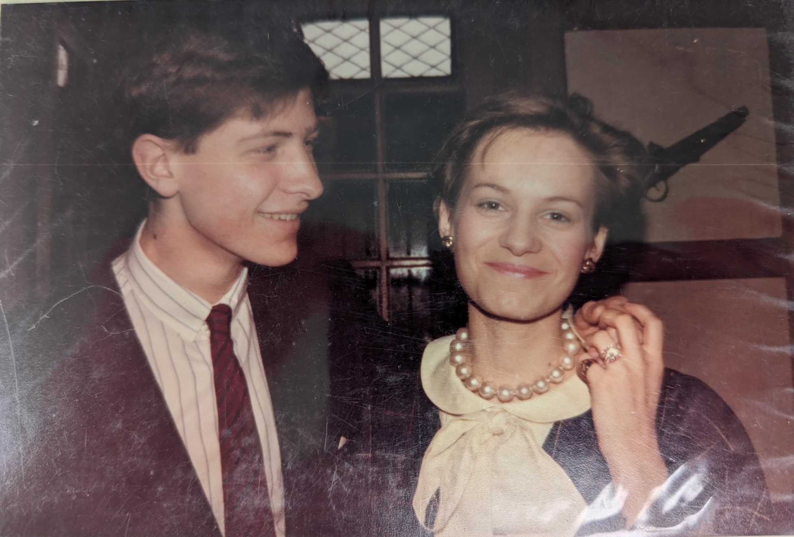
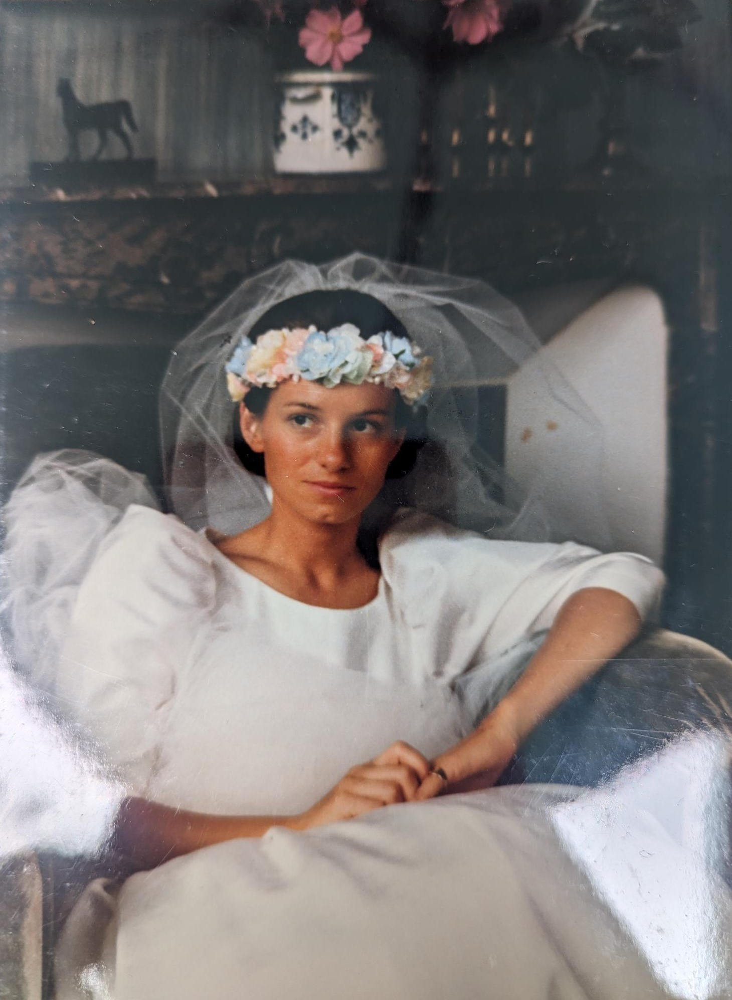

C'est un mot que je n'ai pas eu la chance d'écrire ni de dire de nombreuse fois. J'ai perdu ma maman en février 2023, j'ai construit ma vie sans, bien que mon père se soit remarier il y a une dizaine d'année avec une personne qui l'a beaucoup apporté. Rien ne peut remplacer une mère dans la construction d'unr personne.
Honnêtement, je n'en ai jamais ressenti les effets directements. Puis dans cette période complqiué de ma vie (cf: pourquoi j'ai décidé de partir), je me suis senti assez démuni émotionnellement. incapable de surmonter cette épreuve seul, et dans une terrible douleur. 
J'ai donc décidé d'écrire pour essayer de comprendre et de me comprendre. 

Le premier sujet sur lequel j'ai voulu écrire est ma maman et comment un garçon de 5 survie et se construit après ça. Et bien comme je le dis plus haut, je n'en ai jamais ressenti les effets, contrairement à mes frères sur qui cela a eu un impact  bien plus douloureux et destucteur. Bien que cela ai surement un impact sur ma sensibilité et mon incapcité à gérer mes émotions, je crois que cela n'a pas eu trop d'influence sur ma vie. je pense qu'elle a été un peu près normal. Je pense que c'est ce qui est assez triste au final. à vrai dire elle ne m'a pas trop manqué, on ne  manque pas de ce qu'on ne connait pas. Mes derniers souvenirs remontent à très loin et sont assez floues. C'est un sujet dont je parle assez peu avec ma famille, bizarrement je crois que la personne pour qui le sujet est le plus tabou, c'est moi. On n'en parle assez rarement, et encore moins de sa mort. 

Pourtant c'est à propos de ça que j'aimerai vous parler. Et de ce que j'ai réalisé ces derniers temps. 
Ma maman a fait une depression post naissance. Elle a du se faire soigner par un psy qui l'a très mal soigné. Elle allait chez un docteur, qui était un de ces oncles. Il lui prescrivait des médicaments assez forts qui la shooté. Pendant qu'elle était droguée, il a abusé d'elle. Ma mère a porté plainte avec mon père mais sous la pressioin de la famille elle a du la retirer. Bien sur mon père ne l'a jamais accepter et est retourné porter plainte, la les policiers les ont rassurés et dit qu'une plainte pour viol ne pouvait être retirée.Cela l'a amené dans une dépression encore plus profonde. Qui a duré des années. Mes parents ont tout fait pour la combattre, ils ont déménagés, ont reconstruit leur vie à montpellier. 
Mais malheureusement ce n'est pas toujours suffisant. le 21 février 2003 elle a décidé de se donner la mort.

C'est con à dire mais cela ne m'a jusque là pas trop affecté. Je me comprends, j'ai pu avoir une vie un peu près normal. Inconsciemment, je n'ai jamais trop réalisé sa mort, ni même les circonstances. Je crois que pour moi c'était normal. que c'était normal d'avoir un parent mort, enfin normal dans le sens ou bah c'est la vie, un parent meurt, cela arrive. au final c'est le rôle de nos parents de mourir un jour. Que de toute façon ce monde est assez cruel est complqiué.
C'était ce que je pensais jusqu'à ce que je vois ces photos

  

Des gamins... Plus jeunes que moi. J'ai réalisé que ce qu'on avait violé une enfant avant tout, qu'on avait volé la vie d'une jeune femme qui avait encore toute une vie devant elle.
J'ai vu ces photos, une après-midi, chez mes parents. J'ai réalisé à ce moment là que je n'avais jamais vraiment fait de deuil de sa mort. J'ai réalisé que c'étati principalement du dénie que je faisais. J'avais juste accepté qu'elle était plus là et non décédé. 