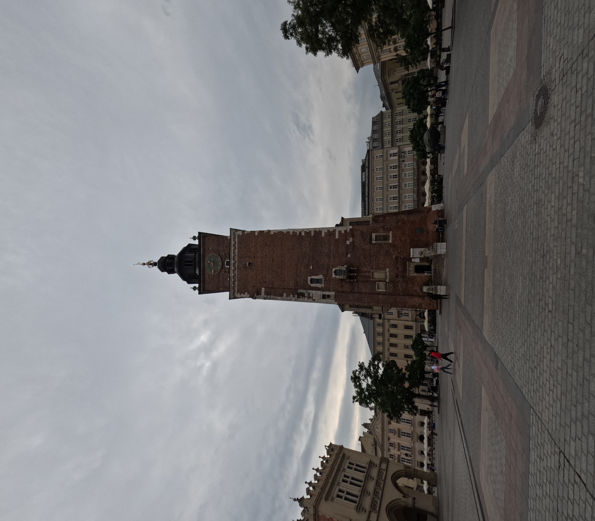

J'ai voulu que la Pologne soit le premier pays à visiter, pour des raisons plutôt arbitraire. 

# Cracovie

## 16 Septembre

Je suis arrivé à 9h à l'aéroport de Cracovie. J'ai pris le bus direction le centre ville. Cracovie est une super jolie ville, le réseau de transport est extrèmement bien développé. Il y a beaucoup de tram et de bus. La première chose qui m'a choqué ce sont les passages piétons, 100% des voitures s'arrêtent au passage piéton. Bref. Le centre ville regorge de monuments historique, le centre est lui même classé au patrimoine mondial de l'UNESCO. J'ai fait la visite de Rynek Główny, une grande place avec une galerie marchande super mignonne.

J'ai déjeuner dans un petit restaurant assez mignon, j'ai pu gouter les spécialités Polonaises dont les fameux Pierogi, des ravioles avec de la viande haché, I-N-C-R-O-Y-A-B-L-E.

J'ai ensuite pu rejoindre mon appartement pour un repos bien mérité, puis je suis ressorti dans la soiré. De nuit la ville est d'autant plus jolie, j'avoue que j'étais bien crevé avec pas loin de 15 km de marche dans les pattes. Mais ça valait le coup.

   

   

## 17 Septembre

J'ai décidé d'aller visiter l'emblématique quartier juif de Cracovie : Kasimierz. Sur la route je me suis pas mal arrété pour prendre des photos et profiter de Cracovie. C'est vraiment une belle ville ou il fait bon se promener.
Une quartier très beau, avec beaucoup de restaurants typiques juifs. Le quartier, par sa propreté et sa beauté nous faire presque oublié qu'il a été quasiment rasé de la carte durant la seconde guerre mondiale et que l'on se trouve à l'entrée d'un des plus gros ghettos de la guerre. On peut encore voir à certains endroits des morceaux du murs. Dans un premier temps j'ai visité la plus vieille synagogue d'europe. Je n'était jamais rentré dans une synagogue, alors je suis plutôt content. Puis je suis allé visiter la fameuse usine de Schindler, dans laquelle ont travaillé plusieurs centaines de juifs afin d'échapper aux chambres à gaz. L'usine a été transformé en musée retraçant l'évolution de la ville de Cracovie durant la seconde guerre mondiale. C'est assez terrifiant de voir à quel point le peuple polonais, notamment les juifs, ont souffert de cette guerre. La Pologne a perdu un habitant sur 6 durant cette période.

(Les photos arrivent)

# Varsovie

Photo de <a href="https://unsplash.com/fr/@destinationeu?utm_content=creditCopyText&utm_medium=referral&utm_source=unsplash">Andrea Anastasakis</a> sur <a href="https://unsplash.com/fr/photos/statue-dune-personne-devant-des-batiments-bruns-GZmxOByPubM?utm_content=creditCopyText&utm_medium=referral&utm_source=unsplash">Unsplash</a>
  